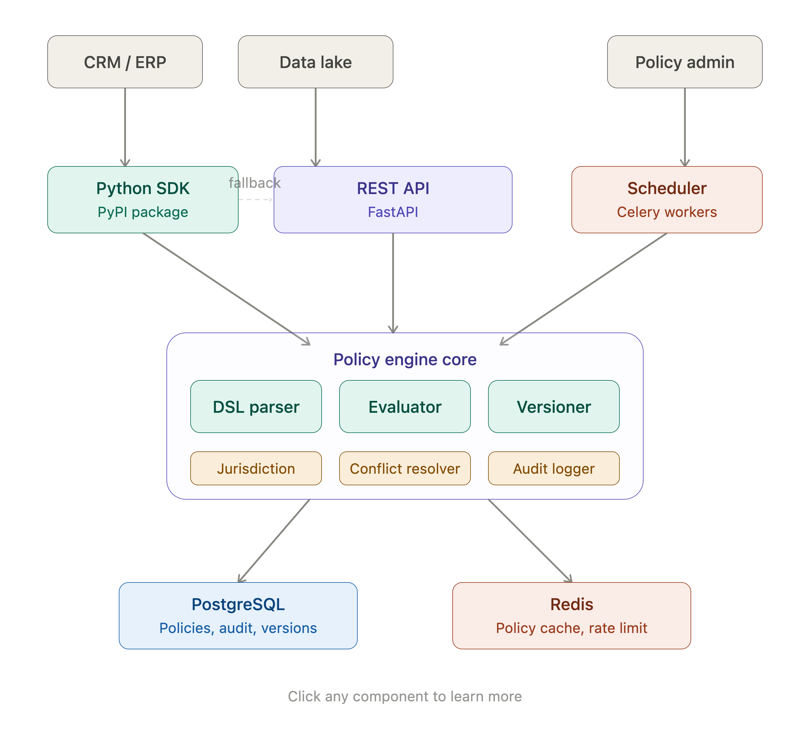

# ROS Policy

Define, evaluate, and enforce data retention policies with full audit trail and GDPR/PDPA compliance.

## Quick Start

### Install

```bash
pip install -e .           # full (API server + SDK)
pip install -e ".[sdk]"    # SDK only (for integrating apps)
```

### Start the API Server

```bash
uvicorn drpe.api.app:app --host 0.0.0.0 --port 8000
```

API docs at `http://localhost:8000/docs`

### Admin UI

```bash
cd admin
cp .env.example .env.local
npm install
npm run dev
```

Open `http://localhost:3000`, connect with your `DRPE_API_KEY` (or leave empty if API auth is off). See [`admin/README.md`](admin/README.md).

**Deploy on Vercel (Royal Platform):**

```bash
./scripts/deploy-admin.sh --link --yes   # first time
./scripts/deploy-admin.sh --prod         # production
```

Or import the repo in the Vercel dashboard under **Royal Platform**, set **Root Directory** to `admin`, and set `DRPE_API_URL` to your public FastAPI base URL. Full steps: [admin/README.md — Deploy on Vercel](admin/README.md#deploy-on-vercel).

Optional **privacy-safe AI**: `pip install -e ".[ai]"` installs [privalyse-mask](https://github.com/khoantd/privalyse-mask) on the API so Policy Import and Evaluate mask PII before LiteLLM.

### Docker

Requires [Docker](https://docs.docker.com/get-docker/) with the Compose plugin.

#### Build images

Use the helper script (recommended) or call `docker build` / `docker compose` directly:

```bash
chmod +x scripts/docker-build.sh   # once

./scripts/docker-build.sh          # build API + Admin → drpe-api:latest, drpe-admin:latest
./scripts/docker-build.sh api      # API only
./scripts/docker-build.sh admin    # Admin only
./scripts/docker-build.sh compose  # build via docker compose only

TAG=v0.1.0 ./scripts/docker-build.sh          # custom tag
NO_CACHE=1 ./scripts/docker-build.sh          # rebuild without cache
```

#### Backend only (VPS)

When Admin is on Vercel and the API runs on a VPS, build the FastAPI image alone:

```bash
chmod +x scripts/build-backend.sh   # once

./scripts/build-backend.sh              # build drpe-api:latest
./scripts/build-backend.sh --save       # also write dist/drpe-api-latest.tar.gz
./scripts/build-backend.sh --platform linux/amd64
./scripts/build-backend.sh --platform linux/amd64 --registry docker.io/myuser --push
TAG=v0.1.0 ./scripts/build-backend.sh --registry docker.io/myuser --push
```

**Registry push** (login first: `docker login` for Docker Hub). Use `--platform linux/amd64` when building on Apple Silicon for a typical x86_64 VPS:

```bash
./scripts/build-backend.sh --platform linux/amd64 --registry docker.io/myuser --push
# on VPS:
docker pull docker.io/myuser/drpe-api:latest
docker run -d --name drpe-api --restart unless-stopped \
  -p 8000:8000 --env-file /path/to/.env docker.io/myuser/drpe-api:latest
```

**Tarball transfer** (no registry):

```bash
./scripts/build-backend.sh --platform linux/amd64 --save
scp dist/drpe-api-latest.tar.gz user@vps:/tmp/
# on VPS:
gunzip -c /tmp/drpe-api-latest.tar.gz | docker load
docker run -d --name drpe-api --restart unless-stopped \
  -p 8000:8000 --env-file /path/to/.env drpe-api:latest
docker exec drpe-api alembic upgrade head   # when DATABASE_URL is set
```

Set `.env` with `DATABASE_URL`, `DRPE_API_KEY`, `DRPE_CORS_ORIGINS` for your Admin origin, etc.

#### Admin UI (Vercel — Royal Platform)

```bash
chmod +x scripts/deploy-admin.sh   # once

./scripts/deploy-admin.sh --link --yes   # create/link ros-policy-admin on Royal Platform
./scripts/deploy-admin.sh                # preview
./scripts/deploy-admin.sh --prod         # production
```

Requires Vercel CLI login (`vercel login` or `VERCEL_TOKEN`) and access to the **royal-platform** team. Set `DRPE_API_URL` in the Vercel project. See [admin/README.md](admin/README.md#deploy-on-vercel).

Equivalent manual builds:

```bash
# API (repo root Dockerfile)
docker build -t drpe-api:latest -f Dockerfile .

# Admin (admin/Dockerfile)
docker build -t drpe-admin:latest -f admin/Dockerfile ./admin

# Or both via Compose
docker compose build
```

#### Run the stack

Run the API and Admin UI together (in-memory stores by default; point `.env` at Postgres/Redis when you need persistence):

```bash
docker compose up --build
# API   http://localhost:8000/docs
# Admin http://localhost:3000
```

After images are already built:

```bash
docker compose up
```

Standalone containers (without Compose):

```bash
docker run --rm -p 8000:8000 --env-file .env drpe-api:latest
docker run --rm -p 3000:3000 \
  -e DRPE_API_URL=http://host.docker.internal:8000 \
  -e DRPE_API_KEY \
  drpe-admin:latest
```

With `DATABASE_URL` set, apply migrations before relying on the DB:

```bash
docker compose run --rm api alembic upgrade head
```

The Admin container reaches the API at `http://api:8000` on the Compose network (`DRPE_API_URL`).

### Postman

Committed collection and local environment live under [`postman/`](postman/):

| File | Purpose |
|------|---------|
| [`postman/DRPE.postman_collection.json`](postman/DRPE.postman_collection.json) | Full `/api/v1` request collection |
| [`postman/DRPE.local.postman_environment.json`](postman/DRPE.local.postman_environment.json) | Local env (`baseUrl`, `apiKey`, resource IDs) |

#### Import in Postman (desktop / web)

1. Open [Postman](https://www.postman.com/downloads/) → **Import** (or **File → Import**).
2. Choose **Upload Files** (or drag-and-drop) and select both:
   - `postman/DRPE.postman_collection.json`
   - `postman/DRPE.local.postman_environment.json`
3. Confirm import. You should see the collection **ROS Policy** and environment **ROS Policy Local**.
4. In the environment picker (top right), select **DRPE Local**.
5. Edit the environment variables:
   - `baseUrl` — default `http://localhost:8000` (use your API host if different)
   - `apiKey` — your `DRPE_API_KEY` (leave empty if API auth is off)
   - Optionally set `policyId`, `jobId`, `requestId`, `webhookId`, `jurisdictionCode` after creating resources
6. Start the API (`uvicorn` or Docker), then run **Health → Health** to verify connectivity.

Auth is **Bearer** (`Authorization: Bearer {{apiKey}}`) at the collection level. The collection mirrors [`openapi/openapi.json`](openapi/openapi.json).

#### Import via Newman / CLI (optional)

```bash
# One-off run against a running API
npx newman run postman/DRPE.postman_collection.json \
  -e postman/DRPE.local.postman_environment.json \
  --env-var "apiKey=$DRPE_API_KEY"
```

### Define a Policy (YAML)

```yaml
policy:
  id: pol_gdpr_customer
  name: "GDPR Customer Data Retention"
  status: active
  jurisdiction: EU_GDPR
  data_classification: PII
  scope:
    data_types: [customer_profile]
  rules:
    - id: rule_inactive_delete
      priority: 100
      condition:
        all:
          - field: "status"
            operator: "eq"
            value: "inactive"
          - field: "last_activity_at"
            operator: "older_than"
            value: "730d"
      action: delete
      grace_period: "30d"
```

### Integrate via SDK (Remote)

```python
from drpe import DRPEClient

client = DRPEClient(base_url="http://localhost:8000", api_key="...")

result = client.evaluate(
    data_type="customer_profile",
    record_id="cust_123",
    metadata={"status": "inactive", "last_activity_at": "2023-01-01T00:00:00Z"}
)

if result.should_delete:
    print(f"Delete after {result.grace_period_ends}")
elif result.should_archive:
    print("Move to archive")
elif result.is_retained:
    print("Keep as-is")
```

### Classify PII / Sensitive Data (Remote)

```python
from drpe import DRPEClient

client = DRPEClient(base_url="http://localhost:8000", api_key="...")

result = client.classify(
    data_type="customer_profile",
    record_id="cust_123",
    metadata={"email": "user@example.com", "ssn": "123-45-6789"},
    jurisdiction="EU_GDPR",
)

for entity in result.detected_entities:
    print(entity.label, entity.classification, entity.sensitivity)
print(result.result.action, result.result.handling)
```

### Integrate via SDK (Embedded — no server needed)

```python
from drpe import PolicyEvaluator, EvaluationRequest

evaluator = PolicyEvaluator.from_directory("./policies/")

result = evaluator.evaluate(EvaluationRequest(
    data_type="customer_profile",
    record_id="cust_123",
    metadata={"status": "inactive", "last_activity_at": "2023-01-01T00:00:00Z"}
))
```

### Decorator-Based Enforcement

```python
@client.enforce(data_type="customer_profile", on_delete=handle_delete)
def get_customer(record_id: str):
    return db.query(Customer).get(record_id)
```

### Generated OpenAPI clients (TypeScript / Go / Java)

Committed clients live under [`clients/`](clients/) (see [`clients/README.md`](clients/README.md)). Spec: [`openapi/openapi.json`](openapi/openapi.json).

```bash
npm install
npm run openapi   # export schema + regenerate TS/Go/Java clients + Admin types
```

```ts
// After: cd clients/typescript && npm install && npm run build
import { Configuration, PoliciesApi } from "drpe-api-client";

const api = new PoliciesApi(
  new Configuration({
    basePath: "http://localhost:8000",
    accessToken: process.env.DRPE_API_KEY,
  }),
);
const policies = await api.listPoliciesApiV1PoliciesGet();
```

## Persistence (Supabase / Postgres)

By default DRPE uses an in-memory store (YAML from `DRPE_POLICIES_DIR` seeded at startup).

To persist policies on **Supabase Postgres** (project lead-flow / schema `drpe`):

1. Set `DATABASE_URL` in `.env` (see `.env.example`). Prefer the **Session pooler** URI from the Supabase dashboard if the direct host is unreachable.
2. Run migrations:

```bash
export DATABASE_URL=postgresql+psycopg://...
alembic upgrade head
```

3. Start the API — `SqlAlchemyPolicyStore` is selected automatically when `DATABASE_URL` is set. YAML is seeded only when the store is empty (or when `DRPE_SEED_YAML=true`).

Tables: `drpe.policies`, `drpe.policy_versions`, `drpe.audit_logs`, `drpe.enforcement_jobs` (RLS enabled; not exposed to `anon`/`authenticated`).

## Redis policy cache

Optional. When `REDIS_URL` (or `DRPE_REDIS_URL`) is set, DRPE wraps the PolicyStore with `CachingPolicyStore`:

- Caches `get` / unfiltered `list` as Policy JSON (`drpe:policy:{id}`, `drpe:policies:ids`)
- Invalidates and bumps `drpe:policies:gen` on upsert/deprecate
- Reloads the in-process evaluator when the generation changes (multi-worker safe)
- `/api/v1/health/ready` PINGs Redis and returns 503 if unreachable
- Read failures fall through to the inner store

Defaults: `DRPE_REDIS_TTL_SECONDS=300`, `DRPE_REDIS_KEY_PREFIX=drpe`. Requires a local Redis (`redis-server`) or a managed Redis URL.

## Enforcement scheduler (Celery)

Periodic and on-demand retention scans:

1. Set `REDIS_URL` (or `CELERY_BROKER_URL`) for a real broker; without it, tasks run **eager** in-process (fine for tests/dev).
2. Optionally set `DRPE_WEBHOOK_URL` to POST dispatched actions; otherwise a logging dispatcher is used.
3. Inject records via a pluggable `RecordSource`, or pass an inline `records` batch to `POST /api/v1/enforce`.

```bash
# API (creates jobs + enqueues tasks)
uvicorn drpe.api.app:app --port 8000

# Worker + beat (when using Redis broker)
celery -A drpe.scheduler.celery_app.celery_app worker -l info
celery -A drpe.scheduler.celery_app.celery_app beat -l info
```

Endpoints: `POST /api/v1/enforce`, `GET /api/v1/enforce/jobs`, `GET /api/v1/enforce/jobs/{id}`, `GET /api/v1/audit/logs`.

Grace periods: destructive actions are audited as `pending_grace` until `grace_period_ends`; `notify` fires when `notify_at` is due.

## Webhook registration

Register HTTP endpoints to receive enforcement/DSAR event notifications:

| Method | Path | Notes |
|--------|------|-------|
| `POST` | `/api/v1/webhooks` | Create; returns `secret` once (auto-generated if omitted) |
| `GET` | `/api/v1/webhooks` | List (`?active=true\|false`) |
| `GET` | `/api/v1/webhooks/{id}` | Get one (`secret` omitted; `secret_set` flag) |
| `PATCH` | `/api/v1/webhooks/{id}` | Update url / events / secret / active / description |
| `DELETE` | `/api/v1/webhooks/{id}` | Remove |

Body fields: `url` (https), `events` (e.g. `["enforcement.delete"]` or `["*"]`), optional `secret`, `description`, `active`. Persistence: in-memory by default; `drpe.webhooks` when `DATABASE_URL` is set (Alembic `004_webhooks`). Fan-out delivery from registered webhooks (beyond `DRPE_WEBHOOK_URL`) is a follow-up.

## Architecture



See [docs/ARCHITECTURE.md](docs/ARCHITECTURE.md) for C4 diagrams, DSL spec, API design, and database schema.

## Project Structure

```
drpe/
├── api/           # FastAPI REST endpoints
├── adapters/      # InMemory + SqlAlchemy + Redis + dispatchers
├── db/            # SQLAlchemy models & session
├── core/          # Evaluator + EnforcementRunner
├── dsl/           # YAML policy parser
├── models/        # Domain models (Pydantic)
├── ports/         # Hexagonal ports
├── sdk/           # Python SDK client
├── scheduler/     # Celery app, beat, enforcement tasks
└── migrations/    # Alembic DB migrations
admin/             # Next.js ops console (BFF over /api/v1)
openapi/           # Committed OpenAPI schema (openapi.json)
clients/           # Generated TS / Go / Java HTTP clients
config/            # Example policy files
postman/           # Postman collection + local environment
scripts/           # OpenAPI export, client gen, docker-build.sh, build-backend.sh, deploy-admin.sh
tests/             # Test suite
docs/              # Architecture docs
alembic.ini        # Alembic config
```

## Running Tests

```bash
pytest tests/ -v
```

## Roadmap

- [x] Core policy evaluator
- [x] YAML DSL parser with validation
- [x] REST API (FastAPI)
- [x] Python SDK (remote + embedded)
- [x] Conflict resolution (priority-based)
- [x] Grace periods and notifications
- [x] Jurisdiction filtering
- [x] PostgreSQL persistence (SQLAlchemy + Alembic / Supabase)
- [x] Redis policy caching
- [x] Immutable audit log (append-only; monthly partitioning deferred)
- [x] Celery-based enforcement scheduler
- [x] DSAR (Data Subject Access Request) workflow
- [x] Webhook registration CRUD
- [x] Policy diff and rollback
- [x] Admin UI
- [x] OpenAPI client generation (TypeScript, Go, Java)
