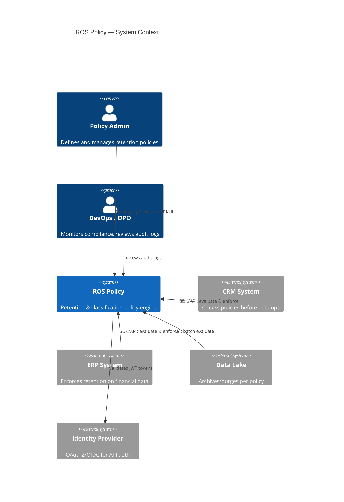
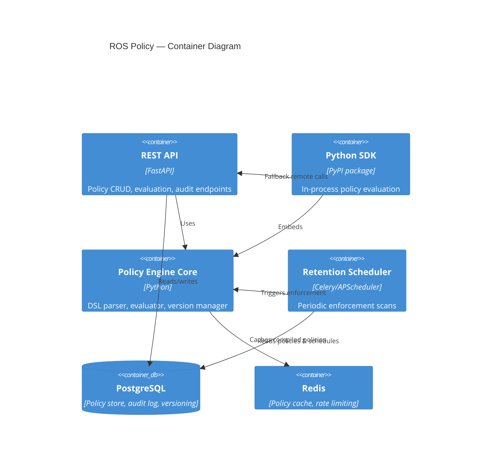
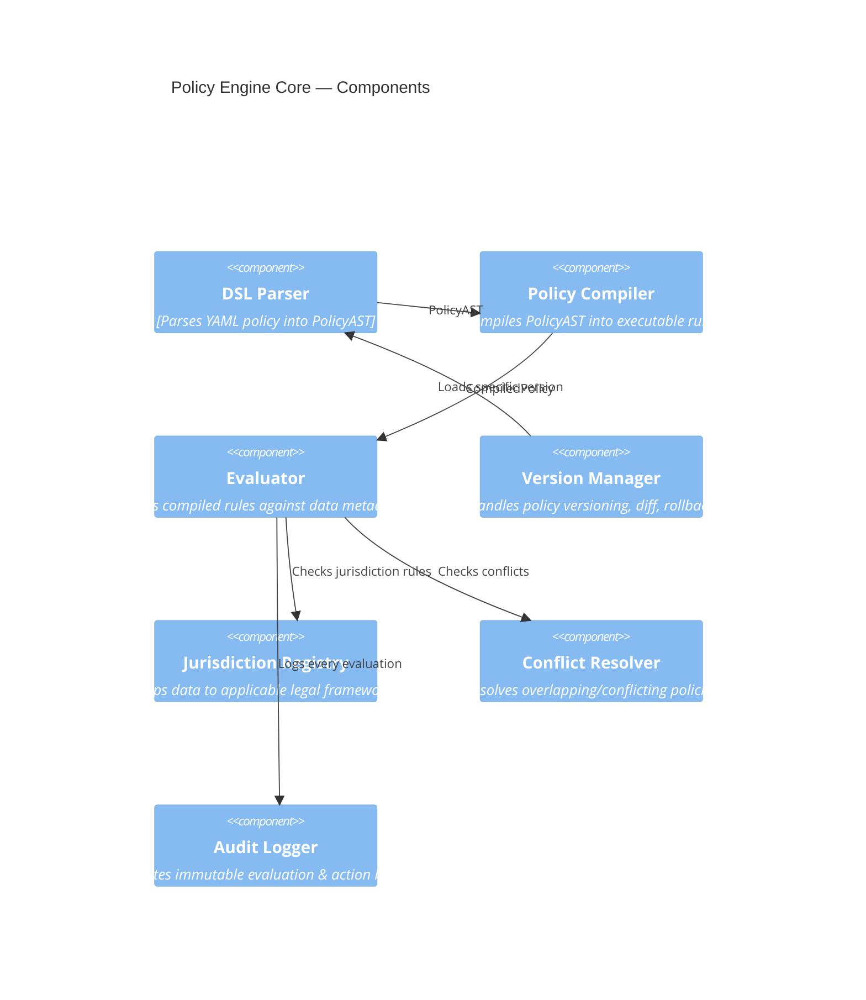

# ROS Policy — Architecture

## 1. System Overview

ROS Policy is a **standalone policy engine** that other applications integrate with to:

1. **Define** data retention policies via a YAML-based DSL
2. **Evaluate** whether a data record should be retained, archived, anonymized, or deleted
3. **Enforce** policies via scheduled scans + webhook callbacks
4. **Audit** every policy evaluation and action with an immutable trail
5. **Version** policies with full history, diff, and rollback
6. **Comply** with GDPR, PDPA, and custom jurisdictional rules

### Architecture Style: Hexagonal (Ports & Adapters)

**Why**: The engine must be usable as both a REST API (remote) and a Python SDK (in-process). Hexagonal architecture keeps the core policy evaluation logic independent of transport and storage, enabling both integration modes from the same codebase.

```
┌─────────────────────────────────────────────────┐
│                  ROS Policy Core                │
│  ┌───────────┐  ┌──────────┐  ┌──────────────┐ │
│  │ Policy DSL│  │ Evaluator│  │ Version Mgr  │ │
│  │  Parser   │  │  Engine  │  │              │ │
│  └───────────┘  └──────────┘  └──────────────┘ │
│  ┌───────────┐  ┌──────────┐  ┌──────────────┐ │
│  │ Audit     │  │ Scheduler│  │ Jurisdiction │ │
│  │ Logger    │  │          │  │ Registry     │ │
│  └───────────┘  └──────────┘  └──────────────┘ │
├─────────────────────────────────────────────────┤
│                    Ports                        │
│  [PolicyStore] [AuditStore] [ActionDispatcher]  │
│  [WebhookSender] [NotificationPort]             │
├─────────────────────────────────────────────────┤
│                   Adapters                      │
│  [PostgresPolicy] [PostgresAudit] [HTTPWebhook] │
│  [FastAPI REST] [Python SDK] [CLI]              │
└─────────────────────────────────────────────────┘
```

---

## 2. C4 Diagrams

### Level 1 — System Context



### Level 2 — Container



### Level 3 — Component (Engine Core)



---

## 3. Policy DSL Specification

### 3.1 Policy Definition (YAML)

```yaml
# Example: GDPR-compliant customer data retention
policy:
  id: pol_gdpr_customer_data
  name: "GDPR Customer Data Retention"
  version: 3
  status: active              # draft | active | deprecated | archived
  jurisdiction: EU_GDPR       # EU_GDPR | VN_PDPD | GLOBAL | custom
  data_classification: PII    # PII | SPII | financial | operational | public
  owner: "dpo@company.com"
  effective_from: "2025-01-01"
  expires_at: null             # null = no expiry
  tags: ["gdpr", "customer", "pii"]

  # Subject scope: which data this policy applies to
  scope:
    data_types:
      - customer_profile
      - customer_contact
    sources:
      - crm_system
      - marketing_platform
    exclude:
      data_types:
        - anonymized_analytics

  # Retention rules (evaluated top-to-bottom, first match wins)
  rules:
    - id: rule_inactive_delete
      description: "Delete inactive customer profiles after 2 years"
      priority: 100
      condition:
        all:
          - field: "status"
            operator: "eq"
            value: "inactive"
          - field: "last_activity_at"
            operator: "older_than"
            value: "730d"
      action: delete
      grace_period: "30d"
      notify_before: "7d"
      requires_approval: false

    - id: rule_active_archive
      description: "Archive active records older than 5 years"
      priority: 200
      condition:
        all:
          - field: "status"
            operator: "eq"
            value: "active"
          - field: "created_at"
            operator: "older_than"
            value: "1825d"
      action: archive
      archive_target: "cold_storage"

    - id: rule_legal_hold
      description: "Legal hold overrides all other rules"
      priority: 1              # highest priority
      condition:
        any:
          - field: "legal_hold"
            operator: "eq"
            value: true
          - field: "tags"
            operator: "contains"
            value: "litigation"
      action: retain
      retain_until: "legal_hold_released"

  # What happens on subject access / erasure request
  dsar:
    right_to_access: true
    right_to_erasure: true
    erasure_exceptions:
      - "legal_obligation"
      - "public_interest"
    response_deadline: "30d"

  # Audit requirements
  audit:
    log_evaluations: true
    log_actions: true
    retention_of_audit_logs: "3650d"   # 10 years
```

### 3.2 DSL Operators

| Operator       | Description                    | Value Type        |
|----------------|--------------------------------|-------------------|
| `eq`           | Equals                         | any               |
| `neq`          | Not equals                     | any               |
| `gt`, `gte`    | Greater than (or equal)        | number / date     |
| `lt`, `lte`    | Less than (or equal)           | number / date     |
| `in`           | Value in list                  | list              |
| `not_in`       | Value not in list              | list              |
| `contains`     | List/string contains value     | any               |
| `older_than`   | Datetime field older than duration | duration string |
| `newer_than`   | Datetime field newer than duration | duration string |
| `is_null`      | Field is null                  | boolean           |
| `regex`        | Matches regex pattern          | string            |

### 3.3 Actions

| Action        | Description                                           |
|---------------|-------------------------------------------------------|
| `retain`      | Keep data, no action — overrides other rules          |
| `archive`     | Move to cold/archive storage                          |
| `anonymize`   | Replace PII fields with anonymized values             |
| `pseudonymize`| Replace identifiers with pseudonyms (reversible)      |
| `delete`      | Permanently delete after grace period                 |
| `notify`      | Notify data owner/subject, take no data action        |
| `flag`        | Flag for manual review                                |

---

## 4. API Design (REST)

### 4.1 Authentication

All API calls require a Bearer JWT token (OAuth2). Scopes:
- `policy:read` — read policies
- `policy:write` — create/update policies
- `policy:admin` — delete, force actions
- `evaluate` — evaluate data against policies
- `audit:read` — read audit logs

### 4.2 Endpoints

```
# ── Policy Management ──
POST   /api/v1/policies                    # Create policy (from YAML or JSON)
GET    /api/v1/policies                    # List policies (filter, paginate)
GET    /api/v1/policies/{policy_id}        # Get policy (latest version)
GET    /api/v1/policies/{policy_id}/versions          # List all versions
GET    /api/v1/policies/{policy_id}/versions/{ver}    # Get specific version
POST   /api/v1/policies/{policy_id}/versions/{ver}/activate  # Rollback: restore snapshot as new head version
PUT    /api/v1/policies/{policy_id}        # Update (creates new version)
DELETE /api/v1/policies/{policy_id}        # Deprecate (soft delete)
POST   /api/v1/policies/{policy_id}/diff   # Diff two versions (`from_version` / `to_version`)
POST   /api/v1/policies/validate           # Validate DSL without saving
POST   /api/v1/policies/import             # Bulk import from YAML file

# ── Policy Evaluation ──
POST   /api/v1/evaluate                    # Evaluate single record
POST   /api/v1/evaluate/batch              # Evaluate batch (up to 1000)
POST   /api/v1/evaluate/dry-run            # Evaluate without side effects

# ── Enforcement ──
POST   /api/v1/enforce                     # Trigger enforcement for a policy
GET    /api/v1/enforce/jobs                 # List enforcement jobs
GET    /api/v1/enforce/jobs/{job_id}        # Job status & progress

# ── DSAR (Data Subject Access Requests) ──
POST   /api/v1/dsar/access                 # Subject access request
POST   /api/v1/dsar/erasure                # Erasure request (right to be forgotten)
GET    /api/v1/dsar/requests               # List DSAR requests
GET    /api/v1/dsar/requests/{request_id}  # DSAR status

# ── Audit ──
GET    /api/v1/audit/logs                  # Query audit logs (filter, paginate)
GET    /api/v1/audit/logs/{log_id}         # Single audit entry
GET    /api/v1/audit/reports               # Compliance reports
POST   /api/v1/audit/export                # Export audit logs (CSV/JSON)

# ── Jurisdictions ──
GET    /api/v1/jurisdictions               # List supported jurisdictions
GET    /api/v1/jurisdictions/{code}         # Jurisdiction details & constraints

# ── Webhooks ──
POST   /api/v1/webhooks                    # Register webhook (returns secret once)
GET    /api/v1/webhooks                    # List webhooks (?active=)
GET    /api/v1/webhooks/{webhook_id}       # Get webhook (secret omitted)
PATCH  /api/v1/webhooks/{webhook_id}       # Update webhook
DELETE /api/v1/webhooks/{webhook_id}       # Remove webhook

# ── Health ──
GET    /api/v1/health                      # Health check
GET    /api/v1/health/ready                # Readiness (DB + cache connected)
```

### 4.3 Evaluate Request/Response

```json
// POST /api/v1/evaluate
// Request
{
  "data_type": "customer_profile",
  "source": "crm_system",
  "record_id": "cust_12345",
  "metadata": {
    "status": "inactive",
    "created_at": "2021-03-15T10:00:00Z",
    "last_activity_at": "2023-06-01T00:00:00Z",
    "legal_hold": false,
    "tags": ["newsletter"]
  },
  "jurisdiction": "EU_GDPR",
  "context": {
    "requester": "crm_cleanup_job",
    "reason": "scheduled_review"
  }
}

// Response
{
  "record_id": "cust_12345",
  "evaluation_id": "eval_abc123",
  "result": {
    "action": "delete",
    "matched_policy": "pol_gdpr_customer_data",
    "matched_rule": "rule_inactive_delete",
    "policy_version": 3,
    "grace_period_ends": "2026-08-21T00:00:00Z",
    "notify_at": "2026-08-14T00:00:00Z",
    "requires_approval": false,
    "confidence": "definitive"
  },
  "conflicting_policies": [],
  "jurisdiction_applied": "EU_GDPR",
  "evaluated_at": "2026-07-22T10:30:00Z",
  "audit_ref": "aud_xyz789"
}
```

---

## 5. Database Schema (PostgreSQL / Supabase)

**Implemented:** private schema `drpe` on Supabase project lead-flow (`yshqwmldepsfckiacjwu`).

```
drpe.policies           — Current policy head (JSONB rules/scope/tags/dsar/audit)
drpe.policy_versions    — Immutable full JSON snapshots per version
drpe.audit_logs         — Append-only evaluation & enforcement events
drpe.enforcement_jobs   — Scheduled/triggered enforcement runs
drpe.dsar_requests      — DSAR access/erasure requests + outcomes
drpe.webhooks           — Registered webhook endpoints (url, events, secret)
```

Migrations: Alembic under `drpe/migrations/` (`alembic upgrade head`). Set `DATABASE_URL`.

RLS is enabled on these tables with no policies for `anon`/`authenticated` (Data API deny-by-default). The FastAPI process connects with the Postgres role (bypasses RLS).

### Redis policy cache (implemented)

When `REDIS_URL` / `DRPE_REDIS_URL` is set, `CachingPolicyStore` wraps the inner PolicyStore (`InMemory` or `SqlAlchemy`):

| Key | Purpose |
|-----|---------|
| `{prefix}:policy:{id}` | Cached Policy JSON (TTL, default 300s) |
| `{prefix}:policies:ids` | Id list for unfiltered `list_policies` |
| `{prefix}:policies:gen` | Generation counter; evaluators reload when it changes |

Writes invalidate policy + ids keys and `INCR` generation. Redis read errors fall through to the inner store; `/api/v1/health/ready` requires a successful `PING` when Redis is configured.

### Enforcement + audit (implemented)

| Table | Purpose |
|-------|---------|
| `drpe.audit_logs` | Append-only evaluation/action/notify/pending_grace/dsar events |
| `drpe.enforcement_jobs` | Scheduled/API-triggered scan jobs + progress |

Celery beat (`scan_due_policies`) and `POST /api/v1/enforce` create jobs; workers run `EnforcementRunner` with grace-aware dispatch. Broker: `CELERY_BROKER_URL` or `REDIS_URL` (eager/`memory://` when unset). Optional `DRPE_WEBHOOK_URL` for HTTP action dispatch.

### DSAR (implemented)

| Table | Purpose |
|-------|---------|
| `drpe.dsar_requests` | Access/erasure requests + collected records / erase outcomes |

Synchronous `DsarService`: collects records from inline payload and `RecordSource` (match `record_id` or `metadata.subject_id`), respects policy `dsar` rights/exceptions/deadline, dispatches erasure via `ActionDispatcher`, audits `dsar_access` / `dsar_erasure`.

API: `POST /api/v1/dsar/access`, `POST /api/v1/dsar/erasure`, `GET /api/v1/dsar/requests`, `GET /api/v1/dsar/requests/{id}`.

### Webhooks (implemented)

| Table | Purpose |
|-------|---------|
| `drpe.webhooks` | Registered callback URLs + event subscriptions + HMAC secret |

CRUD via `/api/v1/webhooks` (create returns secret once; list/get expose `secret_set` only). Env `DRPE_WEBHOOK_URL` remains the single-URL dispatcher fallback; fan-out to registered rows is deferred.

### Policy versioning (implemented)

| Endpoint | Behavior |
|----------|----------|
| `GET .../versions` | List version metadata from immutable snapshots |
| `GET .../versions/{ver}` | Full policy at that version |
| `POST .../versions/{ver}/activate` | Rollback: copy snapshot to a **new** head version (history preserved) |
| `POST .../diff` | Structural JSON diff between two versions |

### Planned tables (not yet implemented)

```
jurisdictions         — Legal framework definitions
api_keys              — API key management (hashed)
```

Monthly partitioning for `audit_logs` is deferred (app-layer append-only today).

### Key Design Decisions

- **audit_logs** is append-only (no UPDATE/DELETE APIs) — monthly partitioning planned later
- **policy_versions** stores full JSON snapshot per version (not diffs) for self-contained rollback
- **Activate = rollback-as-new-version** — never rewrites history; head becomes `current.version + 1` with the chosen snapshot
- **Soft deletes** — `deprecated_at` timestamp / status `deprecated`, never hard delete policies
- **Optimistic locking** via `version` column on policies to prevent concurrent edits
- **Schema isolation** — `drpe` schema avoids colliding with other apps in a shared Supabase project

---

## 6. SDK Design (Python)

```python
from drpe import DRPEClient, PolicyEvaluator

# ── Remote mode (REST API) ──
client = DRPEClient(
    base_url="https://drpe.internal.company.com",
    api_key="drpe_sk_...",
    timeout=5.0,
    retry_config={"max_retries": 3, "backoff_factor": 0.5}
)

# Evaluate a record
result = client.evaluate(
    data_type="customer_profile",
    record_id="cust_12345",
    metadata={
        "status": "inactive",
        "last_activity_at": "2023-06-01T00:00:00Z",
        "legal_hold": False
    },
    jurisdiction="EU_GDPR"
)

if result.action == "delete":
    print(f"Delete after {result.grace_period_ends}")

# Batch evaluate
results = client.evaluate_batch(records=[...])

# ── Embedded mode (no network, policies loaded locally) ──
evaluator = PolicyEvaluator.from_directory("./policies/")
# or
evaluator = PolicyEvaluator.from_yaml(policy_yaml_string)

result = evaluator.evaluate(data_type="customer_profile", metadata={...})

# ── Decorator for automatic enforcement ──
@client.enforce(data_type="customer_profile", on_delete=my_delete_handler)
def get_customer(customer_id: str):
    return db.query(Customer).get(customer_id)
```

---

## 7. Quality Attribute Trade-offs

| Attribute       | Priority | How Addressed                                    |
|-----------------|----------|--------------------------------------------------|
| **Compliance**  | Critical | Immutable audit, jurisdiction registry, DSAR API |
| **Reliability** | High     | Graceful degradation, SDK fallback, retry logic  |
| **Performance** | High     | Redis cache for compiled policies, batch eval    |
| **Extensibility**| High    | DSL-based rules, plugin actions, webhook system  |
| **Security**    | High     | JWT scopes, API key hashing, TLS, no PII in logs |
| **Operability** | Medium   | Health endpoints, structured logging, metrics     |
| **Simplicity**  | Medium   | SDK hides complexity, sensible defaults           |

---

## 8. Non-Goals (v1)

- No built-in UI (API-first; admin UI is a separate concern)
- No cross-datacenter replication (single-region for v1)
- No real-time streaming evaluation (batch + request/response only)
- No automatic data deletion execution (ROS Policy tells you WHAT to do; YOUR system does it)
