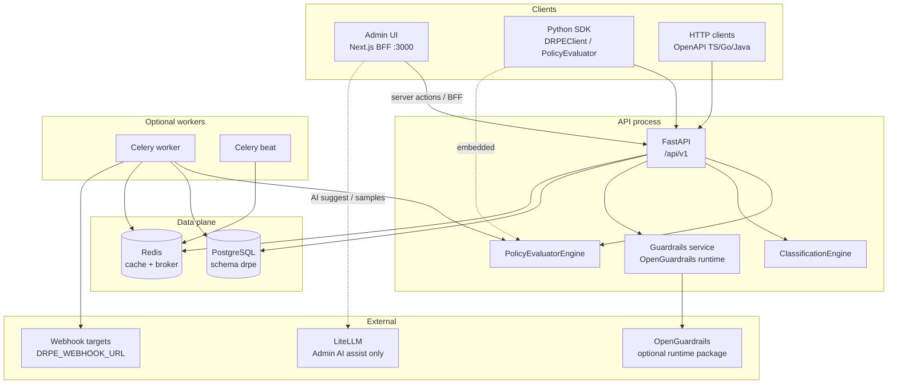
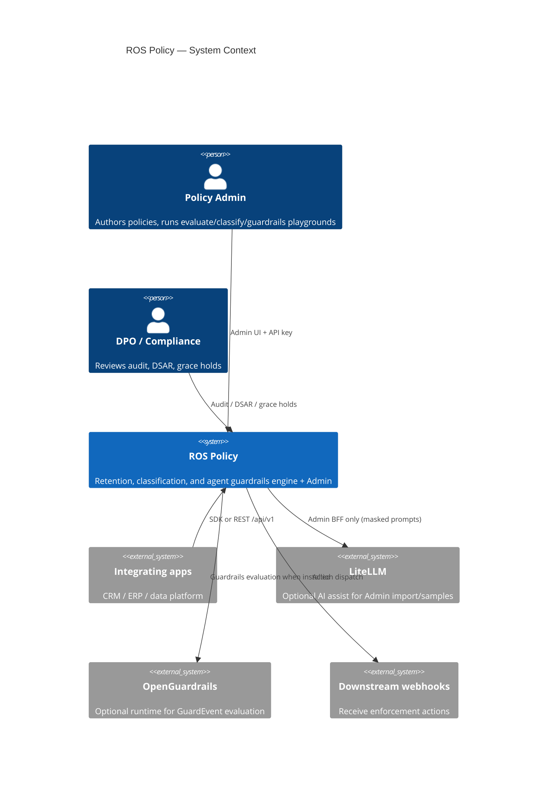
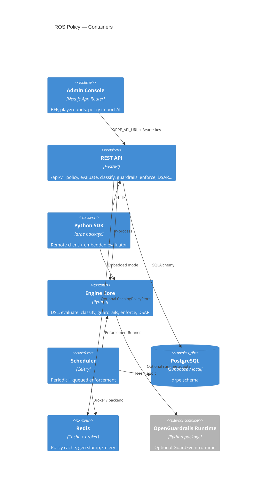

# ROS Policy — Architecture

> Product display name: **ROS Policy**. Technical package/env remain `drpe` / `DRPE_*`.
> Updated: 2026-07-27

## 1. System Overview

ROS Policy is a **standalone retention & classification policy engine** that applications integrate with to:

1. **Define** retention and classification policies via a YAML DSL
2. **Evaluate** whether a record should be retained, archived, anonymized, deleted, etc.
3. **Classify** records for PII/SPII (and related) detections against classification policies
4. **Enforce** policies via scheduled Celery scans + webhook / action dispatch
5. **Audit** enforcement and DSAR outcomes with an append-only trail
6. **Version** policies with full history, structural diff, and rollback-as-new-version
7. **Govern** systems & processes (RoPA-style catalog) linked to policies (metadata only)
8. **Operate** via Admin UI (Next.js BFF) over the same `/api/v1` surface
9. **Guard** agent / LLM workflows with optional OpenGuardrails-backed agent policies and GuardEvent evaluation

### Architecture Style: Hexagonal (Ports & Adapters)

The engine is usable as a **REST API** (remote) and a **Python SDK** (in-process). Core evaluation/classification stays independent of transport and storage.

```
┌──────────────────────────────────────────────────────────────────┐
│                         ROS Policy Core                          │
│  ┌────────────┐ ┌────────────┐ ┌────────────┐ ┌───────────────┐ │
│  │ DSL Parser │ │ Evaluator  │ │ Classifier │ │ Policy Diff   │ │
│  └────────────┘ └────────────┘ └────────────┘ └───────────────┘ │
│  ┌────────────┐ ┌────────────┐ ┌────────────┐ ┌───────────────┐ │
│  │ Enforcement│ │ DSAR Svc   │ │ Guardrails │ │ Conflict Res. │ │
│  └────────────┘ └────────────┘ └────────────┘ └───────────────┘ │
│  ┌────────────┐                                                 │
│  │ Jurisdiction│                                                │
│  └────────────┘                                                 │
├──────────────────────────────────────────────────────────────────┤
│                             Ports                                │
│  PolicyStore · AuditStore · JobStore · DsarStore · WebhookStore  │
│  GraceHoldStore · CatalogStore · GuardrailPolicyStore            │
│  RecordSource · ActionDispatcher · WebhookSender                 │
├──────────────────────────────────────────────────────────────────┤
│                            Adapters                              │
│  InMemory* · SqlAlchemy* · CachingPolicyStore (Redis)            │
│  OpenGuardrails runtime · HttpWebhook · FastAPI · SDK · Celery   │
└──────────────────────────────────────────────────────────────────┘
```

---

## 2. Runtime Topology


```mermaid
flowchart TB
  subgraph clients [Clients]
    Admin["Admin UI<br/>Next.js BFF :3000"]
    SDK["Python SDK<br/>DRPEClient / PolicyEvaluator"]
    HTTP["HTTP clients<br/>OpenAPI TS/Go/Java"]
  end

  subgraph api [API process]
    FastAPI["FastAPI<br/>/api/v1"]
    Engine["PolicyEvaluatorEngine"]
    Classifier["ClassificationEngine"]
    Guardrails["Guardrails service<br/>OpenGuardrails runtime"]
  end

  subgraph workers [Optional workers]
    CeleryW["Celery worker"]
    CeleryB["Celery beat"]
  end

  subgraph data [Data plane]
    PG[(PostgreSQL<br/>schema drpe)]
    Redis[(Redis<br/>cache + broker)]
  end

  subgraph external [External]
    OGR["OpenGuardrails<br/>optional runtime package"]
    LiteLLM["LiteLLM<br/>Admin AI assist only"]
    WebhookTgt["Webhook targets<br/>DRPE_WEBHOOK_URL"]
  end

  Admin -->|server actions / BFF| FastAPI
  Admin -.->|AI suggest / samples| LiteLLM
  SDK --> FastAPI
  SDK -.->|embedded| Engine
  HTTP --> FastAPI
  FastAPI --> Engine
  FastAPI --> Classifier
  FastAPI --> Guardrails
  FastAPI --> PG
  FastAPI --> Redis
  Guardrails --> OGR
  CeleryW --> Engine
  CeleryW --> PG
  CeleryW --> Redis
  CeleryB --> Redis
  CeleryW --> WebhookTgt
```

| Process | Role |
|---------|------|
| **API** (`uvicorn drpe.api.app:app`) | Policy CRUD, evaluate, classify, guardrails, DSAR, webhooks, audit reads, catalog |
| **Celery worker** | Runs queued `POST /enforce` jobs via `EnforcementRunner` |
| **Celery beat** | Periodic `scan_due_policies` when broker is configured |
| **Admin** (`admin/`) | Ops console; holds API key in httpOnly cookie; includes evaluate/classify/guardrails playgrounds; AI via Admin BFF only |

---

## 3. C4 Views

### Level 1 — System Context


```mermaid
C4Context
    title ROS Policy — System Context

    Person(admin, "Policy Admin", "Authors policies, runs evaluate/classify/guardrails playgrounds")
    Person(dpo, "DPO / Compliance", "Reviews audit, DSAR, grace holds")

    System(drpe, "ROS Policy", "Retention, classification, and agent guardrails engine + Admin")

    System_Ext(apps, "Integrating apps", "CRM / ERP / data platform")
    System_Ext(llm, "LiteLLM", "Optional AI assist for Admin import/samples")
    System_Ext(ogr, "OpenGuardrails", "Optional runtime for GuardEvent evaluation")
    System_Ext(hooks, "Downstream webhooks", "Receive enforcement actions")

    Rel(admin, drpe, "Admin UI + API key")
    Rel(dpo, drpe, "Audit / DSAR / grace holds")
    Rel(apps, drpe, "SDK or REST /api/v1")
    Rel(drpe, llm, "Admin BFF only (masked prompts)")
    Rel(drpe, ogr, "Guardrails evaluation when installed")
    Rel(drpe, hooks, "Action dispatch")
```

### Level 2 — Containers


```mermaid
C4Container
    title ROS Policy — Containers

    Container(admin, "Admin Console", "Next.js App Router", "BFF, playgrounds, policy import AI")
    Container(api, "REST API", "FastAPI", "/api/v1 policy, evaluate, classify, guardrails, enforce, DSAR…")
    Container(sdk, "Python SDK", "drpe package", "Remote client + embedded evaluator")
    Container(core, "Engine Core", "Python", "DSL, evaluate, classify, guardrails, enforce, DSAR")
    Container(sched, "Scheduler", "Celery", "Periodic + queued enforcement")
    ContainerDb(db, "PostgreSQL", "Supabase / local", "drpe schema")
    Container(cache, "Redis", "Cache + broker", "Policy cache, gen stamp, Celery")
    Container_Ext(ogr, "OpenGuardrails Runtime", "Python package", "Optional GuardEvent runtime")

    Rel(admin, api, "DRPE_API_URL + Bearer key")
    Rel(sdk, api, "HTTP")
    Rel(sdk, core, "Embedded mode")
    Rel(api, core, "In-process")
    Rel(api, db, "SQLAlchemy")
    Rel(api, cache, "Optional CachingPolicyStore")
    Rel(core, ogr, "Optional runtime adapter")
    Rel(sched, core, "EnforcementRunner")
    Rel(sched, db, "Jobs + audit")
    Rel(sched, cache, "Broker / backend")
```

### Level 3 — Engine Components

| Component | Package path | Responsibility |
|-----------|--------------|----------------|
| DSL Parser | `drpe/dsl/parser.py` | YAML → Pydantic `Policy` / classification policy |
| Evaluator | `drpe/core/evaluator.py` | Match scope + rules; lowest `priority` wins |
| Classifier | `drpe/core/classifier.py` | Entity detection vs classification policies |
| Conflict resolver | `drpe/core/conflict.py` | Surface overlapping matches |
| Jurisdictions | `drpe/core/jurisdictions.py` | Built-in jurisdiction metadata |
| Policy diff | `drpe/core/policy_diff.py` | Structural version diff |
| Enforcement | `drpe/core/enforcement.py` | Scan records, grace, dispatch, audit |
| DSAR service | `drpe/core/dsar.py` | Sync access/erasure workflows |
| Guardrails | `drpe/guardrails/` | Optional OpenGuardrails runtime wrapper + DRPE detectors |
| Privacy | `drpe/privacy/` | Optional PII mask for AI / privacy APIs |

---

## 4. Repository Layout

| Path | Purpose |
|------|---------|
| `drpe/models/` | Domain models (Policy, DSAR, audit, systems/processes, …) |
| `drpe/dsl/` | YAML policy parser |
| `drpe/core/` | Evaluator, classifier, enforcement, DSAR, operators |
| `drpe/api/` | FastAPI `create_app()`, routes, settings, deps |
| `drpe/guardrails/` | OpenGuardrails availability, runtime factory, detectors, evaluate service |
| `drpe/sdk/` | `DRPEClient`, embedded `PolicyEvaluator`, `@enforce` |
| `drpe/ports/` | Protocols (stores, RecordSource, dispatchers) |
| `drpe/adapters/` | In-memory, SQLAlchemy, Redis cache, HTTP webhook |
| `drpe/db/` | ORM rows, session helpers |
| `drpe/migrations/` | Alembic versions `001`–`011` |
| `drpe/scheduler/` | Celery app, tasks, enforcement runtime |
| `drpe/privacy/` | Masking / privacy helpers |
| `admin/` | Next.js ops console (BFF over `/api/v1`) |
| `config/` | Example YAML policies |
| `openapi/` | Committed OpenAPI schema |
| `clients/` | Generated TypeScript / Go / Java clients |
| `docs/ARCHITECTURE.md` | This document |

### Entry points

| Entry | How |
|-------|-----|
| API ASGI | `uvicorn drpe.api.app:app` → `create_app()` |
| Celery | `celery -A drpe.scheduler.celery_app.celery_app worker\|beat` |
| Admin | `cd admin && npm run dev` (port 3000) |
| SDK remote | `from drpe import DRPEClient` |
| SDK embedded | `from drpe import PolicyEvaluator` |

### Store wiring (`create_app`)

1. `DATABASE_URL` set → SQLAlchemy stores; else in-memory stores
2. `REDIS_URL` / `DRPE_REDIS_URL` set → wrap policy store with `CachingPolicyStore` + engine generation sync
3. Seed YAML from `DRPE_POLICIES_DIR` (default `config/`) when store empty, or when `DRPE_SEED_YAML=true` / in-memory mode
4. Guardrails scratch documents use `GuardrailPolicyStore`; seed `config/guardrails/default.policy.json` when that store is empty
5. `GUARDRAILS_ENABLED` toggles runtime access; missing `openguardrails` leaves the API surface up but `/guardrails/evaluate` returns unavailable
6. Celery broker: `CELERY_BROKER_URL` or `REDIS_URL`; eager/`memory://` when unset (`DRPE_CELERY_EAGER`)

---

## 5. Admin UI Architecture

```
Browser → Next.js middleware (session cookie)
       → Server Components / Server Actions
       → admin/lib/drpe-client.ts → FastAPI /api/v1
       → admin/app/api/ai/* → LiteLLM (optional; never auto-imports)
```

| Concern | Implementation |
|---------|----------------|
| Auth | Login sets httpOnly cookie with API key; middleware guards console |
| Data access | Server-side `DRPE_API_URL` + Bearer key; no key in browser JS |
| AI assist | BFF routes: `policy-suggest`, `classify-sample`, `evaluate-sample` |
| Guardrails UX | `/guardrails` loads runtime status, active agent policies, and scratch OGR docs; deep-link via `?policy=` |
| Design | `admin/design-system/` (Fira Sans/Code, blue/amber) |
| OpenAPI types | `admin/lib/generated/schema.d.ts` via `npm run openapi` |

### Console surfaces

| Route | Purpose |
|-------|---------|
| `/` | Overview metrics / attention |
| `/policies`, `/policies/[id]`, `/policies/import`, `/policies/graph` | CRUD, versions, AI import, structure graph |
| `/systems`, `/processes` | Governance catalog + policy links |
| `/evaluate`, `/classify` | Playgrounds (dry-run default for evaluate) |
| `/guardrails` | Agent safety playground; evaluate GuardEvents against active agent policies or scratch OGR docs |
| `/enforce`, `/grace-holds` | Jobs + grace hold actions |
| `/dsar`, `/audit`, `/webhooks` | Requests, audit trail, webhook CRUD |
| `/insights`, `/observability` | Relation graph / LangSmith traces (when configured) |

---

## 6. API Surface (`/api/v1`)

### Authentication

Optional Bearer **`DRPE_API_KEY`**. If unset, API is open (dev/test). Full OAuth2/JWT scopes are deferred.

### Route modules

| Prefix | Module | Notes |
|--------|--------|-------|
| `/policies` | `routes_policies.py` | CRUD, validate, import, versions, activate, diff |
| `/systems` | `routes_systems.py` | Governance catalog |
| `/processes` | `routes_processes.py` | Governance catalog |
| `/classify` | `routes_classify.py` | Single/batch classify + diagnostics |
| `/evaluate` | `routes_evaluate.py` | Single/batch/dry-run |
| `/enforce` | `routes_enforce.py` | Trigger job + list/get jobs |
| `/grace-holds` | `routes_grace_holds.py` | List + approve/cancel style actions |
| `/dsar` | `routes_dsar.py` | Access/erasure + list/get (sync) |
| `/webhooks` | `routes_webhooks.py` | Registration CRUD |
| `/audit` | `routes_audit.py` | Query append-only logs |
| `/health` | `routes_misc.py` | Liveness / readiness (DB + Redis PING) |
| `/jurisdictions` | `routes_misc.py` | Built-in jurisdiction list |
| `/privacy` | `routes_privacy.py` | Mask / privacy helpers |
| `/guardrails` | `routes_guardrails.py` | Runtime status, scratch OGR CRUD, GuardEvent evaluate |

Interactive docs: `http://localhost:8000/docs`. Contract: `openapi/openapi.json`.

### Evaluate (shape)

```json
POST /api/v1/evaluate
{
  "data_type": "customer_profile",
  "source": "crm_system",
  "record_id": "cust_12345",
  "metadata": {
    "status": "inactive",
    "last_activity_at": "2023-06-01T00:00:00Z",
    "legal_hold": false
  },
  "jurisdiction": "EU_GDPR"
}
```

Response includes matched policy/rule, action, grace/notify timestamps, conflicts, and jurisdiction applied.

**Priority:** lowest numeric `priority` wins among matching rules; conflicts are listed, not silently dropped.

---

## 7. Policy DSL (summary)

Example retention policy (see `config/gdpr_customer.yaml`):

```yaml
policy:
  id: pol_gdpr_customer_data
  name: "GDPR Customer Data Retention"
  status: active
  jurisdiction: EU_GDPR
  data_classification: PII
  scope:
    data_types: [customer_profile]
    sources: [crm_system]
  rules:
    - id: rule_inactive_delete
      priority: 100
      condition:
        all:
          - field: status
            operator: eq
            value: inactive
          - field: last_activity_at
            operator: older_than
            value: 730d
      action: delete
      grace_period: 30d
      notify_before: 7d
  dsar:
    right_to_access: true
    right_to_erasure: true
    erasure_exceptions: [legal_obligation, public_interest]
    response_deadline: 30d
```

### Operators

`eq`, `neq`, `gt`/`gte`, `lt`/`lte`, `in`, `not_in`, `contains`, `older_than`, `newer_than`, `is_null`, `regex`

### Actions

`retain`, `archive`, `anonymize`, `pseudonymize`, `delete`, `notify`, `flag`

Policies also support **`policy_kind`**: retention, classification, or agent. Classification policies use entities / text fields rather than retention actions.

Agent policies are first-class records in the main `policies` store. They use the `agent_policy:` YAML root and carry an embedded **`ogr_policy`** JSON document for OpenGuardrails evaluation. Agent policy lifecycle (draft/active/deprecated, versions, activate) is shared with other policy kinds, but execution happens through `POST /api/v1/guardrails/evaluate`, not `/evaluate` or `/classify`.

Optional **`reference_sources`** (AI provenance URLs) are metadata on the policy — not part of the YAML DSL scope and not used for matching (migration `008`).

Scratch / raw OGR documents are also supported under `/api/v1/guardrails/policies`; these live outside the main policy lifecycle and are mainly used for playground / authoring workflows.

---

## 8. Persistence

**Schema:** `drpe` (Postgres / Supabase). Migrations: `alembic upgrade head` through `011_agent_ogr_policy`.

| Table | Purpose |
|-------|---------|
| `policies` | Current policy head (JSONB rules/scope/tags/dsar/audit/reference_sources) |
| `policy_versions` | Immutable full JSON snapshots per version |
| `audit_logs` | Append-only enforcement / DSAR events (**not** an HTTP access log) |
| `enforcement_jobs` | Scheduled/API-triggered scan jobs + progress |
| `dsar_requests` | Access/erasure requests + outcomes |
| `webhooks` | Registered endpoints + events + secret |
| `grace_holds` | Pending grace-period holds |
| `guardrail_policies` | Scratch OpenGuardrails JSON documents for `/guardrails/policies` |
| `systems` / `processes` (+ link tables) | Governance catalog; many-to-many policy links |

`policies.ogr_policy` (migration `011`) stores the OpenGuardrails JSON document for `PolicyKind.agent` rows.

### Redis (optional)

| Key pattern | Purpose |
|-------------|---------|
| `{prefix}:policy:{id}` | Cached policy JSON (TTL) |
| `{prefix}:policies:ids` | Id list for unfiltered list |
| `{prefix}:policies:gen` | Generation counter for multi-worker engine reload |

Pool caps: `DRPE_REDIS_MAX_CONNECTIONS` (default 20), Celery `DRPE_CELERY_BROKER_POOL_LIMIT`.

### Design decisions

- **Audit** written only by `EnforcementRunner` and `DsarService` — evaluate/classify/policy GETs do not append
- **Activate = rollback-as-new-version** — never rewrite `policy_versions` history
- **Soft deprecate** policies; catalog links cleared on deprecate/delete
- **Systems/Processes** are governance metadata only — they do **not** change evaluate/classify matching (Admin can seed `source` from `source_key` for UX)
- **Guardrails availability is soft** — if disabled or `openguardrails` is not installed, status reports unavailable and evaluation returns `503`
- **Agent guardrails use the main policy store** — only scratch OGR docs use `guardrail_policies`
- **Webhook fan-out** to registered rows is deferred; live dispatch still uses `DRPE_WEBHOOK_URL`

---

## 9. Enforcement & DSAR flows

### Enforcement

```
POST /enforce  →  create job (queued)
               →  Celery worker (or eager)
               →  EnforcementRunner
                    · load policy + records (inline and/or RecordSource)
                    · evaluate → grace hold / dispatch action
                    · AuditStore.append
```

Without a worker (and without eager mode), jobs remain `queued`.

### DSAR

Synchronous `DsarService`: collect records (inline + `RecordSource` matching `record_id` / `metadata.subject_id`), apply policy DSAR rights/exceptions, dispatch erasure via `ActionDispatcher`, audit immediately.

### Guardrails

`POST /guardrails/evaluate` accepts either:

- `policy_id` for an **active agent policy** in the main `policies` store (`ogr_policy` is resolved server-side), or
- an inline / scratch OGR policy document.

Flow:

```
Admin/API caller
  → routes_guardrails.py
  → resolve active agent policy or scratch OGR document
  → drpe.guardrails.service.evaluate_event()
  → runtime_factory.build_runtime()
  → OpenGuardrails runtime.evaluate(GuardEvent)
  → VerdictResponse (allow / block / require_approval + reasons/categories/evidence)
```

If the runtime is disabled or the optional dependency is missing, `/guardrails/status` still works but evaluate returns `503`.

---

## 10. SDK

```python
from drpe import DRPEClient, PolicyEvaluator

# Remote (evaluate + classify; dry-run / batch variants)
client = DRPEClient(base_url="http://localhost:8000", api_key="...")
result = client.evaluate(data_type="customer_profile", record_id="c1", metadata={...})
result = client.evaluate_dry_run(...)  # no side effects
result = client.classify(data_type="customer_profile", record_id="c1", metadata={...})
results = client.classify_batch([...])

# Embedded (no network) — loads retention + classification YAML from a directory
evaluator = PolicyEvaluator.from_directory("./policies/")
result = evaluator.evaluate(data_type="customer_profile", metadata={...})
result = evaluator.classify(data_type="customer_profile", metadata={...})
```

`DRPEClient` sends `Authorization: Bearer <api_key>` on every request (including when an injected `http_client` is used). Full admin/governance surface (policies, systems, processes, DSAR, …) is covered by generated OpenAPI clients: `clients/typescript`, `clients/go`, `clients/java` (`npm run openapi`).

---

## 11. Quality attributes

| Attribute | How addressed |
|-----------|---------------|
| Compliance | Immutable audit, jurisdictions, DSAR, grace holds |
| Reliability | Store fallbacks, Redis read fall-through, Celery retries |
| Performance | Redis policy cache, batch evaluate/classify, Admin lazy loads |
| Extensibility | YAML DSL, pluggable RecordSource / ActionDispatcher, optional OpenGuardrails adapter |
| Security | Optional API key, CORS (`DRPE_CORS_ORIGINS`), no secrets in SESSION/docs; AI prompts masked when privacy stack installed |
| Operability | `/health`, `/health/ready`, structured Admin observability |

---

## 12. Non-goals / deferred

- JWT OAuth2 scopes (API key only today)
- Fan-out delivery to all registered webhooks (env URL only for dispatch)
- Monthly partitioning of `audit_logs`
- Catalog `source_key` automatically matching evaluate `scope.sources`
- Cross-region replication / streaming evaluation
- Engine does **not** delete customer data itself — it decides **what** to do; integrators execute via webhooks/handlers
