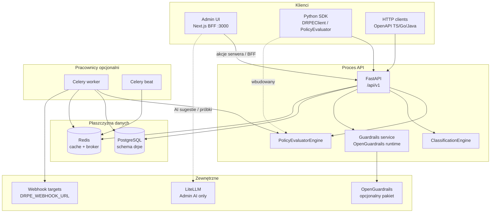
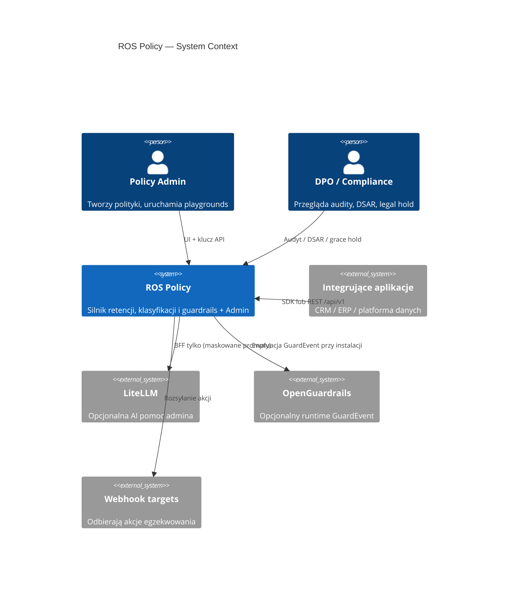
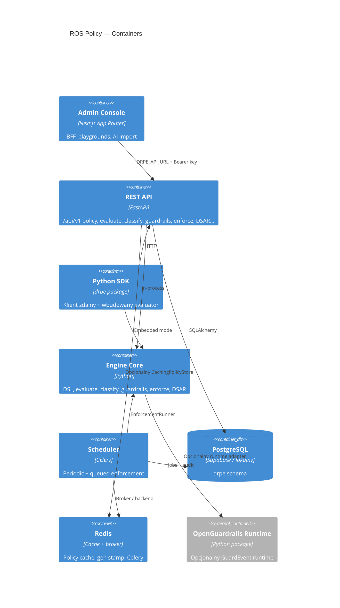

# ADR‑0000: ROS Policy — Architektura  
**Status:** zaakceptowano  
**Autor:** indexer  
**Powiązania:** brak  
**Plik:** `docs/ARCHITECTURE.md`  

---

## 1. Kontekst

ROS Policy to **odrębny silnik do tworzenia, oceny oraz egzekwowania polityk retencji i klasyfikacji**. Aplikacje integrują się z nim w następujący sposób:

1. **Definiowanie** polityk retencji/klasyfikacji w YAML‑owym DSL.  
2. **Ocena** czy rekord powinien zostać przechowany, archiwizowany, zanonimizowany, usunięty itp.  
3. **Klasyfikacja** rekordów (PII, SPII, itp.) zgodnie z politykami klasyfikacji.  
4. **Egzekwowanie** polityk przy pomocy zaplanowanych skanów Celery oraz webhooków / dispatcherów akcji.  
5. **Audyt** wyników egzekwowania i DSAR w postaci append‑only trail.  
6. **Wersjonowanie** polityk – pełna historia, diff strukturalny oraz możliwość rollbacku jako nowej wersji.  
7. **Zarządzanie** systemami i procesami (katalog RoPA‑style) powiązanymi z politykami (tylko metadane).  
8. **Obsługa** interfejsu Admin UI (Next.js BFF) korzystającego z tej samej powierzchni `/api/v1`.  
9. **Ochrona** agentów / workflowów LLM przy pomocy opcjonalnych polityk GuardEvent opartych na OpenGuardrails.

---

## 2. Decyzja

Decyzje architektoniczne (podstawy projektowe):

* **Styl architektury:** hexagonalne (Ports & Adapters).  
* **Dostępność:** REST API oraz wbudowany Python SDK (tryb wbudowany – bez wywołań sieciowych).  
* **Modularność:** Core (parsowanie DSL, ewaluacja, klasyfikacja, egzekwowanie, DSAR, Guardrails) pozostaje niezależny od transportu i magazynu.  
* **Rozszerzalność:** Porty (store’y, dispatcher’y, źródła danych) oraz adaptery (InMemory, SqlAlchemy, Redis, OpenGuardrails runtime, FastAPI, Celery) umożliwiają łatwe wprowadzanie nowych technologi.  
* **Bezpieczeństwo i kontrola:** Autoryzacja kluczem `DRPE_API_KEY` (opcjonalna), brak OAuth2/JWT – rozszerzalne w przyszłości.  
* **Pamięć i skalowalność:** PostgreSQL (Supabase / lokalny) jako główny store, Redis jako cache i broker Celery.  
* **Agent‑polityki:** Używają tej samej tabeli `policies`; w przypadku agentów przechowywane jest pole `ogr_policy` z dokumentem OpenGuardrails.  
* **Wersjonowanie polityk:** Aktywacja = `rollback-as-new-version`; polityki są zawsze append‑only.  

---

## 3. Konsekwencje

* **Zależność tylko od API/SDK** – core jest niezależny od transportu, co ułatwia testowanie i wstawianie w różne środowiska.  
* **Elastyczność** – łatwe dodawanie nowych store’ów (np. in-memory, S3, etc.) bez zmian w core.  
* **Złożoność** – porty i adaptery zwiększają liczbę komponentów, ale zapewniają modularność.  
* **Wydajność** – Redis cache pozwala na szybkie odczyty polityk i generuje identyfikator wersji silnika.  
* **Bezpieczeństwo** – brak automatycznego importu AI (LiteLLM), tylko włączane poprzez BFF.  
* **Wielowątkowość** – Celery obsługuje asynchroniczne zadania egzekwowania; w trybie eager (domyślnie `memory://`) zadania są wykonywane natychmiast.  

---

## 4. Szczegóły architektoniczne

### 4.1 Diagram systemu (ASCII)

```
┌──────────────────────────────────────────────────────────────────┐
│                         ROS Policy Core                          │
│  ┌────────────┐ ┌────────────┐ ┌────────────┐ ┌───────────────┐ │
│  │ DSL Parser │ │ Evaluator  │ │ Classifier │ │ Policy Diff   │ │
│  └────────────┘ └────────────┘ └────────────┘ └───────────────┘ │
│  ┌────────────┐ ┌────────────┐ ┌────────────┐ ┌───────────────┐ │
│  │ Enforcement│ │ DSAR Svc   │ │ Guardrails │ │ Conflict Res. │ │
│  └────────────┘ └────────────┘ └────────────┘ └───────────────┘ │
│  ┌────────────┐                                                 │
│  │ Jurisdiction│                                                │
│  └────────────┘                                                 │
├──────────────────────────────────────────────────────────────────┤
│                             Ports                                │
│  PolicyStore · AuditStore · JobStore · DsarStore · WebhookStore  │
│  GraceHoldStore · CatalogStore · GuardrailPolicyStore            │
│  RecordSource · ActionDispatcher · WebhookSender                 │
├──────────────────────────────────────────────────────────────────┤
│                            Adapters                              │
│  InMemory* · SqlAlchemy* · CachingPolicyStore (Redis)            │
│  OpenGuardrails runtime · HttpWebhook · FastAPI · SDK · Celery   │
└──────────────────────────────────────────────────────────────────┘
```

### 4.2 Topologia uruchomieniowa (Mermaid)


```mermaid
flowchart TB
  subgraph clients [Klienci]
    Admin["Admin UI<br/>Next.js BFF :3000"]
    SDK["Python SDK<br/>DRPEClient / PolicyEvaluator"]
    HTTP["HTTP clients<br/>OpenAPI TS/Go/Java"]
  end

  subgraph api [Proces API]
    FastAPI["FastAPI<br/>/api/v1"]
    Engine["PolicyEvaluatorEngine"]
    Classifier["ClassificationEngine"]
    Guardrails["Guardrails service<br/>OpenGuardrails runtime"]
  end

  subgraph workers [Pracownicy opcjonalni]
    CeleryW["Celery worker"]
    CeleryB["Celery beat"]
  end

  subgraph data [Płaszczyzna danych]
    PG[(PostgreSQL<br/>schema drpe)]
    Redis[(Redis<br/>cache + broker)]
  end

  subgraph external [Zewnętrzne]
    OGR["OpenGuardrails<br/>opcjonalny pakiet"]
    LiteLLM["LiteLLM<br/>Admin AI only"]
    WebhookTgt["Webhook targets<br/>DRPE_WEBHOOK_URL"]
  end

  Admin -->|akcje serwera / BFF| FastAPI
  Admin -.->|AI sugestie / próbki| LiteLLM
  SDK --> FastAPI
  SDK -.->|wbudowany| Engine
  HTTP --> FastAPI
  FastAPI --> Engine
  FastAPI --> Classifier
  FastAPI --> Guardrails
  FastAPI --> PG
  FastAPI --> Redis
  Guardrails --> OGR
  CeleryW --> Engine
  CeleryW --> PG
  CeleryW --> Redis
  CeleryB --> Redis
  CeleryW --> WebhookTgt
```

### 4.3 Widoki C4

#### Level 1 — Kontekst systemu


```mermaid
C4Context
    title ROS Policy — System Context

    Person(admin, "Policy Admin", "Tworzy polityki, uruchamia playgrounds")
    Person(dpo, "DPO / Compliance", "Przegląda audity, DSAR, legal hold")

    System(drpe, "ROS Policy", "Silnik retencji, klasyfikacji i guardrails + Admin")

    System_Ext(apps, "Integrujące aplikacje", "CRM / ERP / platforma danych")
    System_Ext(llm, "LiteLLM", "Opcjonalna AI pomoc admina")
    System_Ext(ogr, "OpenGuardrails", "Opcjonalny runtime GuardEvent")
    System_Ext(hooks, "Webhook targets", "Odbierają akcje egzekwowania")

    Rel(admin, drpe, "UI + klucz API")
    Rel(dpo, drpe, "Audyt / DSAR / grace hold")
    Rel(apps, drpe, "SDK lub REST /api/v1")
    Rel(drpe, llm, "BFF tylko (maskowane prompty)")
    Rel(drpe, ogr, "Ewaluacja GuardEvent przy instalacji")
    Rel(drpe, hooks, "Rozsyłanie akcji")
```

#### Level 2 — Kontenery


```mermaid
C4Container
    title ROS Policy — Containers

    Container(admin, "Admin Console", "Next.js App Router", "BFF, playgrounds, AI import")
    Container(api, "REST API", "FastAPI", "/api/v1 policy, evaluate, classify, guardrails, enforce, DSAR…")
    Container(sdk, "Python SDK", "drpe package", "Klient zdalny + wbudowany evaluator")
    Container(core, "Engine Core", "Python", "DSL, evaluate, classify, guardrails, enforce, DSAR")
    Container(sched, "Scheduler", "Celery", "Periodic + queued enforcement")
    ContainerDb(db, "PostgreSQL", "Supabase / lokalny", "drpe schema")
    Container(cache, "Redis", "Cache + broker", "Policy cache, gen stamp, Celery")
    Container_Ext(ogr, "OpenGuardrails Runtime", "Python package", "Opcjonalny GuardEvent runtime")

    Rel(admin, api, "DRPE_API_URL + Bearer key")
    Rel(sdk, api, "HTTP")
    Rel(sdk, core, "Embedded mode")
    Rel(api, core, "In-process")
    Rel(api, db, "SQLAlchemy")
    Rel(api, cache, "Opcjonalny CachingPolicyStore")
    Rel(core, ogr, "Opcjonalny runtime adapter")
    Rel(sched, core, "EnforcementRunner")
    Rel(sched, db, "Jobs + audit")
    Rel(sched, cache, "Broker / backend")
```

#### Level 3 — Komponenty silnika

*Zobacz sekcję “Szczegóły architektoniczne” oraz diagram ASCII powyżej.*

---

## 5. Konfiguracja i inicjalizacja

* `DATABASE_URL` → SQLAlchemy store’y; w braku – pamięć w RAM.  
* `REDIS_URL` / `DRPE_REDIS_URL` → `CachingPolicyStore` oraz synchronizacja wersji silnika.  
* Seeding YAML z `DRPE_POLICIES_DIR` (domyślnie `config/`) przy pustym store, lub przy `DRPE_SEED_YAML=true` / w trybie in‑memory.  
* Dokumenty Guardrails zapisują się w `GuardrailPolicyStore`; domyślny `config/guardrails/default.policy.json` wstawiany przy pustym store.  
* `GUARDRAILS_ENABLED` przełącza dostępność runtime; brak `openguardrails` → endpoint `/guardrails/evaluate` zwraca `503`.  
* Broker Celery: `CELERY_BROKER_URL` lub `REDIS_URL`; domyślny `memory://` (tryb eager).  

---

## 6. Architektura UI

```
Browser → Next.js middleware (session cookie)
       → Server Components / Server Actions
       → admin/lib/drpe-client.ts → FastAPI /api/v1
       → admin/app/api/ai/* → LiteLLM (opcjonalny; nigdy nie auto‑importuje)
```

---

## 7. Powierzchnia API (`/api/v1`)

### 7.1 Autoryzacja

* Opcjonalny klucz Bearer **`DRPE_API_KEY`**.  
* Brak klucza → otwarty interfejs (tylko dev/test).  
* OAuth2/JWT planowane w przyszłości.

### 7.2 Moduły tras

* Dokumentacja interaktywna: `http://localhost:8000/docs`.  
* Kontrakt: `openapi/openapi.json`.

### 7.3 `evaluate` (przykład)

```json
POST /api/v1/evaluate
{
  "data_type": "customer_profile",
  "source": "crm_system",
  "record_id": "cust_12345",
  "metadata": {
    "status": "inactive",
    "last_activity_at": "2023-06-01T00:00:00Z",
    "legal_hold": false
  },
  "jurisdiction": "EU_GDPR"
}
```

*Odpowiedź* zawiera dopasowaną politykę/zasadę, akcję, terminy grace/notify, konflikty oraz zastosowaną jurysdykcję.  
*Priorytet* – najniższy numer `priority` decyduje o akcji; konflikty są zwracane, a nie ignorowane.  

---

## 8. DSL polityk

### Przykład polityki retencji (`config/gdpr_customer.yaml`)

```yaml
policy:
  id: pol_gdpr_customer_data
  name: "GDPR Customer Data Retention"
  status: active
  jurisdiction: EU_GDPR
  data_classification: PII
  scope:
    data_types: [customer_profile]
    sources: [crm_system]
  rules:
    - id: rule_inactive_delete
      priority: 100
      condition:
        all:
          - field: status
            operator: eq
            value: inactive
          - field: last_activity_at
            operator: older_than
            value: 730d
      action: delete
      grace_period: 30d
      notify_before: 7d
  dsar:
    right_to_access: true
    right_to_erasure: true
    erasure_exceptions: [legal_obligation, public_interest]
    response_deadline: 30d
```

#### Operatory

`eq`, `neq`, `gt`/`gte`, `lt`/`lte`, `in`, `not_in`, `contains`, `older
