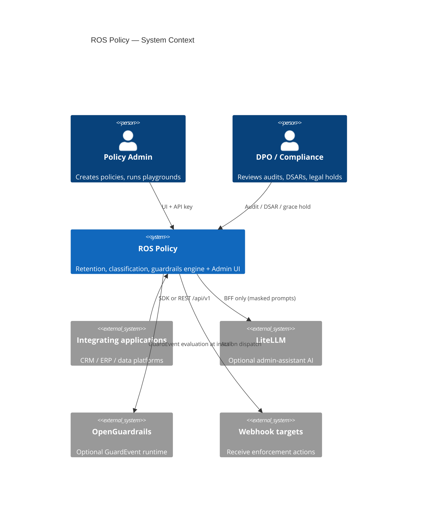
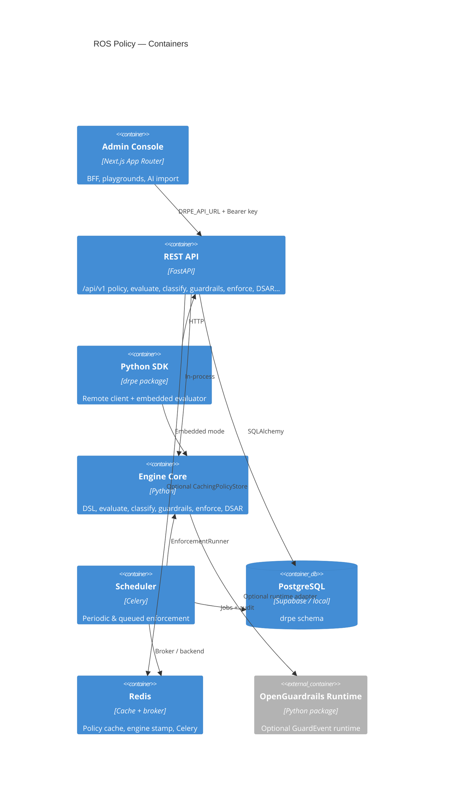

# ADR‑0000: ROS Policy — Architecture  

**Status:** accepted  
**Author:** indexer  
**Linked views:** none  
**File:** `docs/ARCHITECTURE.md`  

---  

## Context  

ROS Policy is an **independent engine for creating, evaluating, and enforcing retention and classification policies**. Applications interact with it in the following ways:  

1. **Define** retention/classification policies in a YAML‑based DSL.  
2. **Evaluate** whether a record should be stored, archived, anonymised, deleted, etc.  
3. **Classify** records (PII, SPII, etc.) according to classification policies.  
4. **Enforce** policies using scheduled Celery scans, webhooks, and action dispatchers.  
5. **Audit** enforcement results and DSARs as an append‑only trail.  
6. **Version** policies – full history, structural diffs, and rollback as a new version.  
7. **Manage** systems and processes (RoPA‑style catalog) linked to policies (metadata only).  
8. **Support** an Admin UI (Next.js BFF) that uses the same `/api/v1` surface.  
9. **Protect** LLM agents/workflows with optional GuardEvent policies based on OpenGuardrails.  

---  

## Decision  

Architectural decisions that form the basis of the design:  

* **Architecture style:** hexagonal (Ports & Adapters).  
* **Accessibility:** REST API and a built‑in Python SDK (embedded mode – no network calls).  
* **Modularity:** Core (DSL parsing, evaluation, classification, enforcement, DSAR, Guardrails) remains independent of transport and persistence.  
* **Extensibility:** Ports (stores, dispatcher, data sources) and adapters (InMemory, SqlAlchemy, Redis, OpenGuardrails runtime, FastAPI, Celery) enable easy addition of new technologies.  
* **Security & control:** Authorization via optional `DRPE_API_KEY`; no OAuth2/JWT currently (future‑extendable).  
* **Memory & scalability:** PostgreSQL (Supabase or local) as the primary store, Redis as cache and Celery broker.  
* **Agent‑policy storage:** Agents use the same `policies` table; for agents an `ogr_policy` column holds an OpenGuardrails document.  
* **Policy versioning:** Activation = `rollback-as-new-version`; policies are always append‑only.  

---  

## Consequences  

* **Transport independence:** Core is agnostic to API/SDK, easing testing and embedding in various environments.  
* **Flexibility:** Adding new stores (e.g., in‑memory, S3) requires only adapter changes.  
* **Complexity:** Ports and adapters increase component count but provide modularity.  
* **Performance:** Redis cache allows fast policy reads and engine version stamping.  
* **Security:** No automatic AI import (LiteLLM); it is only enabled via the BFF.  
* **Concurrency:** Celery handles asynchronous enforcement; eager mode (`memory://`) executes tasks immediately.  

---  

## Architectural Details  

### 4.1 System Diagram (ASCII)

```
┌──────────────────────────────────────────────────────────────────┐
│                         ROS Policy Core                          │
│  ┌────────────┐ ┌────────────┐ ┌────────────┐ ┌───────────────┐ │
│  │ DSL Parser │ │ Evaluator  │ │ Classifier │ │ Policy Diff   │ │
│  └────────────┘ └────────────┘ └────────────┘ └───────────────┘ │
│  ┌────────────┐ ┌────────────┐ ┌────────────┐ ┌───────────────┐ │
│  │ Enforcement│ │ DSAR Svc   │ │ Guardrails │ │ Conflict Res. │ │
│  └────────────┘ └────────────┘ └────────────┘ └───────────────┘ │
│  ┌────────────┐                                                 │
│  │ Jurisdiction│                                                │
│  └────────────┘                                                 │
├──────────────────────────────────────────────────────────────────┤
│                             Ports                                │
│  PolicyStore · AuditStore · JobStore · DsarStore · WebhookStore  │
│  GraceHoldStore · CatalogStore · GuardrailPolicyStore            │
│  RecordSource · ActionDispatcher · WebhookSender                 │
├──────────────────────────────────────────────────────────────────┤
│                            Adapters                              │
│  InMemory* · SqlAlchemy* · CachingPolicyStore (Redis)            │
│  OpenGuardrails runtime · HttpWebhook · FastAPI · SDK · Celery   │
└──────────────────────────────────────────────────────────────────┘
```

### 4.2 Runtime Topology (Mermaid)


```mermaid
flowchart TB
  subgraph clients [Clients]
    Admin["Admin UI<br/>Next.js BFF :3000"]
    SDK["Python SDK<br/>DRPEClient / PolicyEvaluator"]
    HTTP["HTTP clients<br/>OpenAPI TS/Go/Java"]
  end

  subgraph api [API Process]
    FastAPI["FastAPI<br/>/api/v1"]
    Engine["PolicyEvaluatorEngine"]
    Classifier["ClassificationEngine"]
    Guardrails["Guardrails service<br/>OpenGuardrails runtime"]
  end

  subgraph workers [Optional Workers]
    CeleryW["Celery worker"]
    CeleryB["Celery beat"]
  end

  subgraph data [Data Plane]
    PG[(PostgreSQL<br/>schema drpe)]
    Redis[(Redis<br/>cache + broker)]
  end

  subgraph external [External]
    OGR["OpenGuardrails<br/>optional package"]
    LiteLLM["LiteLLM<br/>Admin AI only"]
    WebhookTgt["Webhook targets<br/>DRPE_WEBHOOK_URL"]
  end

  Admin -->|server actions / BFF| FastAPI
  Admin -.->|AI suggestions / samples| LiteLLM
  SDK --> FastAPI
  SDK -.->|embedded| Engine
  HTTP --> FastAPI
  FastAPI --> Engine
  FastAPI --> Classifier
  FastAPI --> Guardrails
  FastAPI --> PG
  FastAPI --> Redis
  Guardrails --> OGR
  CeleryW --> Engine
  CeleryW --> PG
  CeleryW --> Redis
  CeleryB --> Redis
  CeleryW --> WebhookTgt
```

### 4.3 C4 Diagrams  

#### Level 1 – System Context  


```mermaid
C4Context
    title ROS Policy — System Context

    Person(admin, "Policy Admin", "Creates policies, runs playgrounds")
    Person(dpo, "DPO / Compliance", "Reviews audits, DSARs, legal holds")

    System(drpe, "ROS Policy", "Retention, classification, guardrails engine + Admin UI")

    System_Ext(apps, "Integrating applications", "CRM / ERP / data platforms")
    System_Ext(llm, "LiteLLM", "Optional admin‑assistant AI")
    System_Ext(ogr, "OpenGuardrails", "Optional GuardEvent runtime")
    System_Ext(hooks, "Webhook targets", "Receive enforcement actions")

    Rel(admin, drpe, "UI + API key")
    Rel(dpo, drpe, "Audit / DSAR / grace hold")
    Rel(apps, drpe, "SDK or REST /api/v1")
    Rel(drpe, llm, "BFF only (masked prompts)")
    Rel(drpe, ogr, "GuardEvent evaluation at install")
    Rel(drpe, hooks, "Action dispatch")
```

#### Level 2 – Containers  


```mermaid
C4Container
    title ROS Policy — Containers

    Container(admin, "Admin Console", "Next.js App Router", "BFF, playgrounds, AI import")
    Container(api, "REST API", "FastAPI", "/api/v1 policy, evaluate, classify, guardrails, enforce, DSAR…")
    Container(sdk, "Python SDK", "drpe package", "Remote client + embedded evaluator")
    Container(core, "Engine Core", "Python", "DSL, evaluate, classify, guardrails, enforce, DSAR")
    Container(sched, "Scheduler", "Celery", "Periodic & queued enforcement")
    ContainerDb(db, "PostgreSQL", "Supabase / local", "drpe schema")
    Container(cache, "Redis", "Cache + broker", "Policy cache, engine stamp, Celery")
    Container_Ext(ogr, "OpenGuardrails Runtime", "Python package", "Optional GuardEvent runtime")

    Rel(admin, api, "DRPE_API_URL + Bearer key")
    Rel(sdk, api, "HTTP")
    Rel(sdk, core, "Embedded mode")
    Rel(api, core, "In‑process")
    Rel(api, db, "SQLAlchemy")
    Rel(api, cache, "Optional CachingPolicyStore")
    Rel(core, ogr, "Optional runtime adapter")
    Rel(sched, core, "EnforcementRunner")
    Rel(sched, db, "Jobs + audit")
    Rel(sched, cache, "Broker / backend")
```

#### Level 3 – Core Components  

See the ASCII diagram in section 4.1 for the detailed component layout.  

---  

## Configuration & Initialization  

| Variable | Purpose | Default |
|----------|---------|---------|
| `DATABASE_URL` | SQLAlchemy store URL; if omitted, in‑memory store is used. | – |
| `REDIS_URL` / `DRPE_REDIS_URL` | Redis for `CachingPolicyStore` and engine version sync. | – |
| `DRPE_POLICIES_DIR` | Directory with YAML policy seeds (default `config/`). | `config/` |
| `DRPE_SEED_YAML` | When `true` seed the store with policies on startup (also works in memory). | `false` |
| `GUARDRAILS_ENABLED` | Enables OpenGuardrails runtime; missing `openguardrails` → `/guardrails/evaluate` returns `503`. | `false` |
| `CELERY_BROKER_URL` | Celery broker; defaults to `memory://` (eager). | `memory://` |
| `DRPE_API_KEY` | Optional Bearer key for API access. | – |

When the store is empty, the engine loads the default policy from `config/guardrails/default.policy.json` into `GuardrailPolicyStore`.

---  

## UI Architecture  

```
Browser → Next.js middleware (session cookie)
       → Server Components / Server Actions
       → admin/lib/drpe-client.ts → FastAPI /api/v1
       → admin/app/api/ai/* → LiteLLM (optional; never auto‑imports)
```

---  

## API Surface (`/api/v1`)  

### Authentication  

* Optional Bearer key **`DRPE_API_KEY`**.  
* Without the key the API is open (dev/test only).  
* OAuth2/JWT is planned for the future.  

### Route Modules  

* Interactive docs: `http://localhost:8000/docs`.  
* Contract: `openapi/openapi.json`.  

### Example – `evaluate`  

```http
POST /api/v1/evaluate
Content-Type: application/json

{
  "data_type": "customer_profile",
  "source": "crm_system",
  "record_id": "cust_12345",
  "metadata": {
    "status": "inactive",
    "last_activity_at": "2023-06-01T00:00:00Z",
    "legal_hold": false
  },
  "jurisdiction": "EU_GDPR"
}
```

**Response** contains the matched policy, action, grace/notify periods, conflicts, and the jurisdiction applied. The lowest `priority` number wins; conflicts are returned rather than ignored.

---  

## Policy DSL  

### Example – Retention Policy (`config/gdpr_customer.yaml`)  

```yaml
policy:
  id: pol_gdpr_customer_data
  name: "GDPR Customer Data Retention"
  status: active
  jurisdiction: EU_GDPR
  data_classification: PII
  scope:
    data_types: [customer_profile]
    sources: [crm_system]
  rules:
    - id: rule_inactive_delete
      priority: 100
      condition:
        all:
          - field: status
            operator: eq
            value: inactive
          - field: last_activity_at
            operator: older_than
            value: 730d
      action: delete
      grace_period: 30d
      notify_before: 7d
  dsar:
    right_to_access: true
    right_to_erasure: true
    erasure_exceptions: [legal_obligation, public_interest]
    response_deadline: 30d
```

#### Operators  

| Operator | Meaning |
|----------|---------|
| `eq` | equal |
| `neq` | not equal |
| `gt` | greater than |
| `gte` | greater than or equal |
| `lt` | less than |
| `lte` | less than or equal |
| `in` | value in list |
| `not_in` | value not in list |
| `contains` | string contains |
| `older` | field older than X |
| `newer` | field newer than X |

---  

*End of ADR‑0000.*
